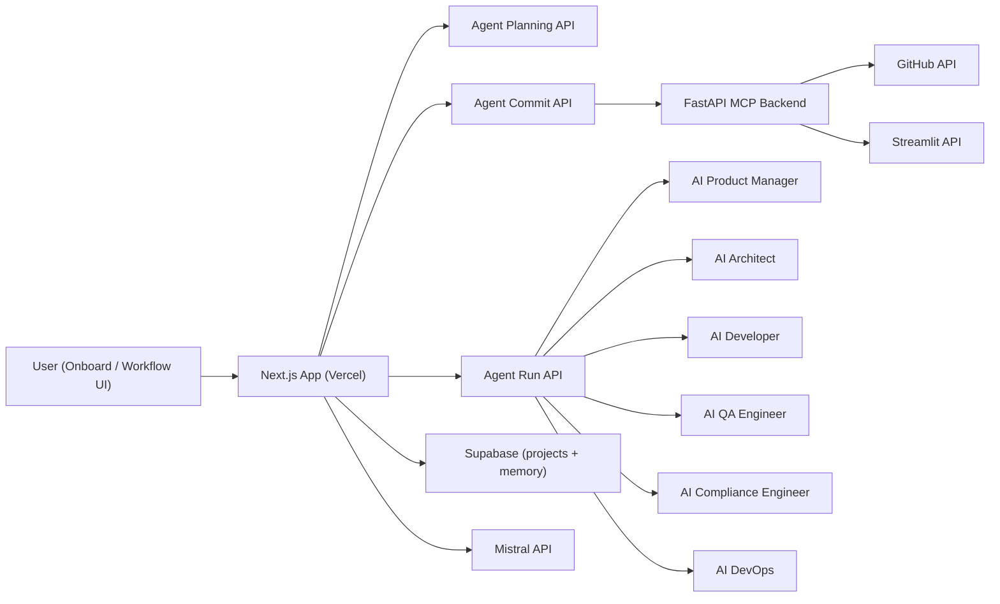

# Orchestral AI

[](https://orchestral-ai.vercel.app/)
[](https://nextjs.org/)
[](https://fastapi.tiangolo.com/)

Orchestral AI is a multi-agent orchestration platform that turns project requirements into executable workflows.  
It combines a visual workflow builder, agent execution simulation, GitHub publishing, and Streamlit deployment automation in one interface.

Repository: [binaryshrey/Orchestral-AI](https://github.com/binaryshrey/Orchestral-AI)  
Live App: [orchestral-ai.vercel.app](https://orchestral-ai.vercel.app/)

## Product Preview

<!-- Replace these placeholders with real images -->


## Built With

### Frontend

- Next.js 16
- React 19
- TypeScript
- Tailwind CSS
- React Flow
- WorkOS AuthKit
- Supabase JS

### Backend

- FastAPI
- Uvicorn
- Supabase
- GitHub REST API
- Streamlit MCP routes

### AI and Integrations

- Mistral API (agent planning and execution)
- ElevenLabs (voice agent sessions)
- Anam SDK (avatar streaming)
- GitHub MCP integration
- Streamlit MCP integration

## Architecture

Orchestral AI is split into two runtime layers:

1. `orchestral-ai/` (Next.js app)
2. `backend/` (FastAPI integration layer for MCP services)



## Default Agent Team

- AI Product Manager
- AI Architect
- AI Developer
- AI QA Engineer
- AI Compliance Engineer
- AI DevOps

### Architecture Diagram Placeholder


## Key Features

- Visual multi-agent workflow canvas under `/dashboard/agents-workflow`
- Agent and task node editing with edge-based execution order
- Execution simulation with status tracking and runtime logs
- Agent memory persistence in Supabase for error-aware retries
- Automatic GitHub repository creation and file commits
- Optional Streamlit deployment trigger after successful push
- MCP-style app connection flow from onboarding
- Voice/avatar pitch and feedback session flows

## Core User Flow

1. User enters project details in `/dashboard/onboard`
2. App generates an agent plan and workflow graph
3. User customizes agents, tasks, and dependencies
4. Execution runs task-by-task with logs and retries
5. Outputs are committed to GitHub
6. Streamlit deployment can be triggered from the same run

### User Flow Placeholder


## API Overview

### Next.js API Routes

- `POST /api/agents/plan` - generates workflow agents/tasks from project input
- `POST /api/agents/run` - executes a task with the assigned agent
- `POST /api/agents/commit` - pushes generated files to GitHub and handles deploy handoff
- `POST /api/agents/memory` - stores execution error memory entries
- `GET /api/pitch` - returns config for investor simulation session
- `GET /api/feedback` - returns config for coach feedback session

### FastAPI MCP Routes

- `POST /mcp/github/connect` - register GitHub credentials
- `PUT /mcp/github/contents/{owner}/{repo}` - create/update repo files
- `POST /mcp/streamlit/connect` - register Streamlit/GitHub deployment credentials
- `POST /mcp/streamlit/apps/{owner}/{repo}/deploy` - trigger streamlit redeploy

## Assets

- UI static assets: `orchestral-ai/public/`
- Pixel agent sprites: `orchestral-ai/public/pixel-agents/`
- SQL setup scripts: `orchestral-ai/supabase/`

### Asset Placeholders


## Development Setup

### Prerequisites

- Node.js 20+
- npm
- Python 3.10+
- pip

### 1) Clone

```bash
git clone https://github.com/binaryshrey/Orchestral-AI.git
cd Orchestral-AI
```

### 2) Frontend Setup

```bash
cd orchestral-ai
npm install
# create/update .env.local with required keys
npm run dev
```

Frontend runs on `http://localhost:3000`.

### 3) Backend Setup

```bash
cd backend
python -m venv .venv
source .venv/bin/activate
pip install -r requirements.txt
uvicorn app.main:app --reload --port 8000
```

Backend runs on `http://localhost:8000`.

## Configuration

Set environment variables for:

- Supabase (`NEXT_PUBLIC_SUPABASE_URL`, `NEXT_PUBLIC_SUPABASE_ANON_KEY`, `SUPABASE_SERVICE_ROLE_KEY`)
- Mistral (`MISTRAL_API_KEY`)
- GitHub MCP backend (`NEXT_PUBLIC_API_URL`, GitHub PAT for connection flow)
- Streamlit MCP connection credentials
- WorkOS auth keys
- Anam and ElevenLabs keys/agent IDs for simulation modules

## Deployment

- Frontend: deployed on Vercel at [https://orchestral-ai.vercel.app/](https://orchestral-ai.vercel.app/)
- Backend: deploy `backend/` as a FastAPI service (Render/GCP/other)
- Ensure CORS and environment variables are configured for production domains

## Roadmap

- More model providers and routing policies
- Richer execution analytics and lineage
- Template marketplace for reusable agent workflows
- Team collaboration and shared workspaces

## License

No license file is currently configured in this repository.
